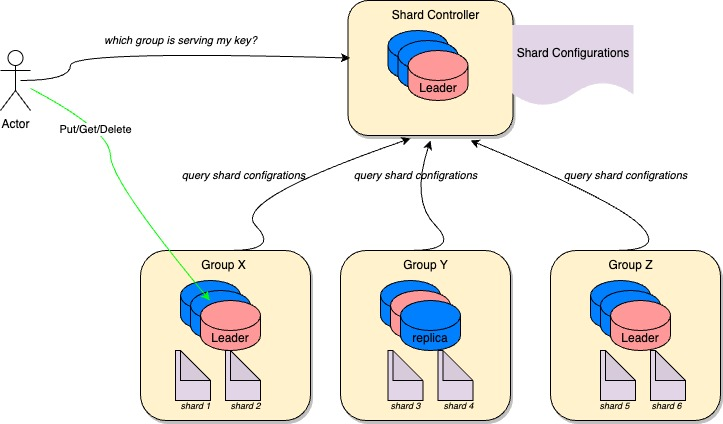

# Distributed Key-Value storage system

## Project Overview

This project aims to develop a distributed key-value store from scratch, offering insights into the complexities of building distributed systems.

## Design Goals

The key properties envisioned for this system are:

- **Strong Consistency**: Ensuring that the system provides a coherent view of data at all times, easing the burden on application developers. 
In addition, the system should be designed to function properly even in the presence of lossy network connections.

- **Availability**: The system should gracefully handle fail-stop failures and autonomously recover to ensure continuous operation, minimizing the need for manual intervention.

- **Performance**: While not aiming for blazingly fast speed, the system should deliver sufficiently good performance to be viable for real-world production use cases.

## Overal Architecture


The system comprises different components, with each group employing a replication strategy as a replicated state machine, utilizing [**Raft**](https://raft.github.io/) as a consensus protocol:
- **Shard Controller**: Responsible for configuring shard information, it supports various types of queries for retrieving, adding, and removing new groups of replicas.
- **Replica Group(s)**: One or many groups of replicas, each responsible for a set of shards (decided by the Shard Controller). They can perform shard migration once the Shard Controller switches to a new configuration.

## Testing 
Testing is arguably the most crucial aspect of any project, and I've discovered that executing it effectively for distributed systems can be particularly challenging, especially when simulating lossy networks.

All tests can be located in the `test` folder. The system incorporates mock network communication between nodes and injects various configurations to simulate an unreliable network, including packet drops, duplicate packets, and packet reordering

## Benchmark
I have benchmarked the system's performance under my simulated network, including simulated disk writes by writing to memory. This allowed me to observe how fast the Raft implementation is.

The benchmarking device is a laptop with 8GB of RAM and an 8-core CPU. The system consists of 3 replicas, and here are the results
```angular2html
Doing 1000 request takes 103.236 miliseconds
Requests/Second: 9686.54
```

## Future Considerations

The project is by no means complete since I haven't integrated it with a real network library and disk storage interface. Furthermore, the Raft implementation is currently naively implemented as described in the Raft paper, but there are potential optimizations for performance:

- **Batching Operations**: Combining multiple operations into each disk write can improve efficiency.
- **Pipeline AppendEntries**: Implementing the ability to send multiple AppendEntries per RPC call can enhance throughput.
- **Revising Disk Storage**: Revising the disk storage to support sending snapshots could involve storing data as a B-Tree on disk, with a hash for each page to compare and sending only the pages that are missing.
